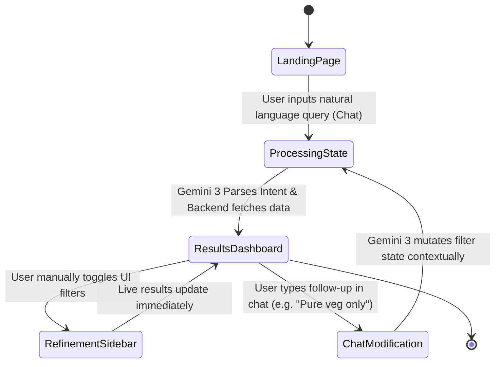

# 🚀 Bangalore AI Restaurant Recommender: Technical & Product Manifesto

## 1. Product Section (GPM Perspective)

**Value Proposition:**
While traditional apps like Zomato force users to tap through rigid, predefined boolean filters (e.g., "Rating > 4.0" AND "Cuisine = Italian"), the **AI Vibe Summary** fundamentally changes discovery by understanding *context*. Instead of navigating menus, users simply ask for the "vibe" they want (e.g., "A quiet, romantic rooftop in Indiranagar"). The AI doesn't just filter rows; it reads the sentiments of reviews to extract the *why*—dynamically generating a personalized 2-sentence pitch for each restaurant that explains why it matches their specific mood.

**User Personas:**
- **The Bangalore Foodie:** Extremely familiar with the city's intense traffic and micro-neighborhoods (HSR, Koramangala). They know what they want but suffer from choice paralysis. They are looking for specific neighborhood gems, date spots, or highly-rated hidden finds without endlessly scrolling through generic lists.

**Key Features:**
1. **Natural Language Search:** Replaces rigid UI with a human-centric chat input.
2. **Dynamic Filter Syncing:** The "Smooth-Segue". The AI parses text into physical UI filters (checkboxes, sliders) that the user can still manually tweak.
3. **AI-Powered Summaries:** Real-time streaming generation of "Vibe Summaries" directly on the results cards.
4. **Contextual Memory:** Users can refine searches Conversationally (e.g., Follow up: "Make it pure veg and cheaper") without losing the initial context.

---

## 2. User Flow & Journey



*(Journey: Landing Page (Chat) ➔ Processing State (Gemini Parsing) ➔ Results Dashboard (Card Grid) ➔ Refinement (Sidebar Filters) ➔ Back to Chat.)*

---

## 3. API Specification (FastAPI Backend)

The backend is built with **FastAPI** to provide extreme execution speed and native async support, ideal for handling concurrent LLM network requests.

### `POST /api/v1/recommend`
Translates the query using Gemini, searches the dataset, and returns matches.
- **Input:** 
  ```json
  { 
    "query": "Quiet cafes in HSR Layout", 
    "session_id": "usr-12345" 
  }
  ```
- **Output:**
  ```json
  {
    "active_filters": {
      "location": "HSR Layout",
      "cuisines": ["Cafe"],
      "min_rating": null,
      "pure_veg": null
    },
    "restaurants": [
      {
        "id": "res_8912",
        "name": "Third Wave Coffee",
        "rating": 4.5,
        "price_for_two": 800,
        "cuisines": ["Cafe", "Desserts"],
        "ai_summary": "Highly praised for its quiet ambience and reliable Wi-Fi, making it a perfect spot for deep work.",
        "metadata": { "url": "https://zomato.com/..." }
      }
    ]
  }
  ```

### `GET /api/v1/health`
- **Output:** `{ "status": "ok", "uptime": 3421, "version": "1.0.0" }`
- **Purpose:** Simple, low-latency health check for Render container monitoring and zero-downtime deployments.

### `POST /api/v1/summarize`
- **Input:** `{ "restaurant_id": "res_8912", "user_query": "Quiet cafes", "session_id": "usr-12345" }`
- **Output:** Streamed or raw JSON string containing the regenerated vibe contextualization.
- **Purpose:** Dedicated endpoint for re-generating or streaming summaries if a user refreshes a card, preventing the need to re-query the entire database.

---

## 4. Technical Infrastructure & Updates

**Frontend (Vercel):**
- **State Store (Zustand):** Zustand acts as the single source of truth (`QueryStore`). It flawlessly synchronizes the `active_filters` object between the chat interface (where filters are inferred by AI) and the sidebar (where filters are physically toggled). Any change in the sidebar updates the store, which immediately triggers a re-render of the UI and re-fetches from the FastAPI backend.

**Backend (Render):**
- **Data Persistence Strategy (512MB RAM Instance):**
  Given Render's strict 512MB free-tier memory limit, loading a massive embedded vector database or full Pandas dataframe into RAM is risky.
  - *Strategy:* **SQLite**. We will convert the cleaned `zomato_cleaned.csv` into a highly optimized, local SQLite file. SQLite operates directly from the disk with minimal memory overhead, perfectly executing relational filtering (Location = 'HSR', Rating > 4.0).
  - For vector embeddings (fuzzy location/cuisine/vibe matching), we will use a small, quantized **FAISS** index that maps directly to the SQLite primary keys. Because it is quantized, the index will fit well within ~100MB of RAM, leaving ample remaining memory (400MB) for FastAPI workers and Gemini asynchronous request handling.

---

## 5. Deployment Directory Structure

```text
ai_2_enhanced_restaurant_recommender/
├── ARCHITECTURE.md               # This Technical/Product Manifesto
├── .env.example                  # Core API Keys and App Configs
├── phase_1_data_pipeline/        # Data Cleaning & Ingestion Scripts
├── phase_2_nlp_intent_parsing/   # Intent parsing logic (FastAPI / Serverless candidate)
├── phase_3_frontend_state_sync/  # Next.js App Router & Zustand (Deployed to Vercel)
├── phase_4_ai_enrichment/        # AI Streaming & Card UI Components
└── phase_5_chat_refinement/      # Chat Widget & Mutational State API
```
